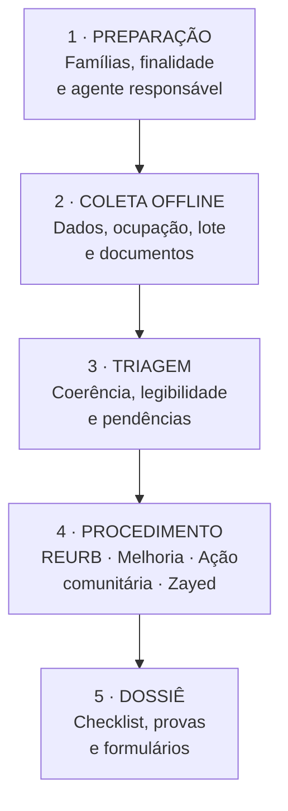
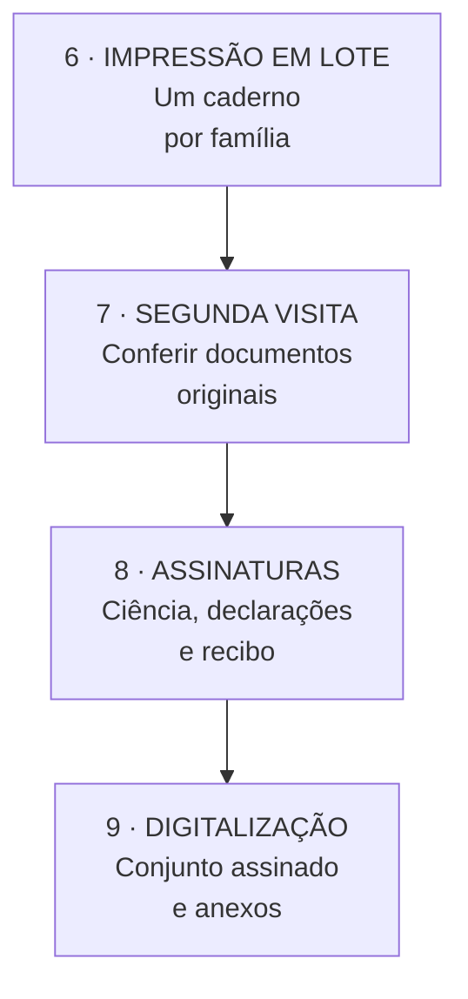
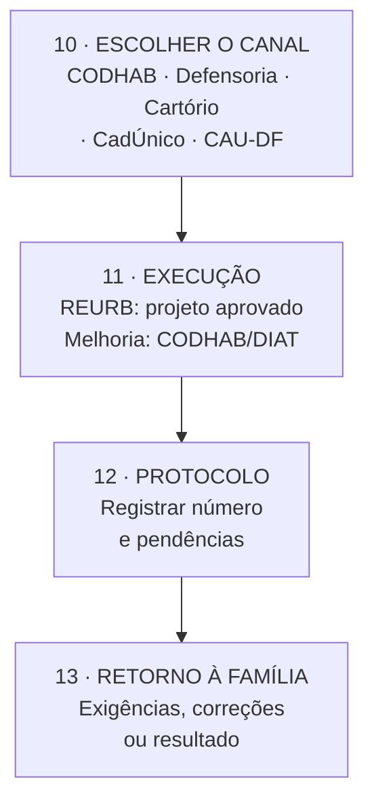

# Aplicativo de triagem documental para regularização fundiária urbana

> **Para apreciação do grupo da Formação ATHIS 2026**
>
> Este documento adapta uma iniciativa em desenvolvimento no estado de São
> Paulo (Assentamento Mário Lago / Coletivo Terra Viva), onde um aplicativo
> offline de triagem documental está sendo estruturado para apoiar a
> regularização fundiária de famílias assentadas.
>
> A arquitetura e o fluxo foram aqui traduzidos para a realidade urbana do
> Sol Nascente/DF, com os procedimentos, órgãos e formulários próprios da
> REURB, da CODHAB, da Defensoria Pública e do CadÚnico.
>
> **O que se pede ao grupo:**
>
> 1. **Apreciação** — o conceito faz sentido para a realidade do território?
> 2. **Viabilidade jurídica** — arquitetos, advogados e defensores presentes
>    na formação podem avaliar se o fluxo proposto é compatível com os
>    procedimentos oficiais de regularização fundiária no DF?
> 3. **Sugestões de execução** — que ajustes, simplificações ou acréscimos
>    seriam necessários para que a ferramenta pudesse ser útil como atividade
>    prática dos eixos de regularização fundiária e ações comunitárias?
>
> O desenvolvimento técnico (PWA offline-first, criptografia local, geração
> de PDFs) pode ser orientado por Fabio, mas o desenho do formulário, os
> fluxos de aprovação e a adequação normativa dependem da expertise do grupo.
> A ideia é que a ferramenta sirva como **legado concreto da formação** para o
> território — algo que permaneça após o ciclo de 2026.

## Finalidade

O aplicativo deverá apoiar a coleta comunitária, organizar evidências,
identificar pendências e preparar dossiês de pré-cadastro para conferência e
encaminhamento aos órgãos competentes (CODHAB, Defensoria Pública, Cartório de
Registro de Imóveis). Ele **não regulariza o imóvel**, não substitui vistoria
técnica, análise fundiária, cadastrador autorizado ou acesso individual a
sistemas oficiais.

O produto de cada atendimento será um dossiê de pré-cadastro, com
identificação única, checklist, documentos digitalizados e formulários
aplicáveis. Depois da revisão, o sistema poderá gerar em lote os cadernos de
cada família para conferência e assinatura em uma nova visita.

O desenvolvimento pode envolver profissionais da própria formação (arquitetos
e urbanistas, assistentes sociais, estudantes de TI) e servir como atividade
prática dos eixos de regularização fundiária e ações comunitárias.

---

## Fluxo de coleta, assinatura e encaminhamento

### 1. Agente comunitário e aplicativo

### 2. Documento físico

### 3. Encaminhamento institucional

**Agente comunitário:** coleta, confere, organiza, digitaliza, imprime e
orienta, sob supervisão da coordenação da formação.

**Documento físico:** originais, declarações aplicáveis, autorização de
encaminhamento, assinaturas e recibo.

**Canal institucional:** cada órgão tem seu próprio fluxo. O aplicativo
prepara o dossiê, mas o protocolo formal é feito pelo responsável legal ou
pelo próprio morador quando exigido.

> Credenciais: o agente não deve guardar senha ou código de autenticação, nem
> utilizar sistemas oficiais como se fosse o requerente.

---

## Primeiro passo: identificar o procedimento

A regularização fundiária urbana (REURB) no Distrito Federal segue o PDOT e a
Lei 13.465/2017. Diferentemente da regularização rural (Incra/PGTA), o
processo urbano envolve:

| Situação encontrada | Encaminhamento | O que o app pode preparar |
|---|---|---|
| Família ocupa lote em ARIS (Área de Regularização de Interesse Social) | REURB-S (interesse social) via CODHAB | dados, cronologia da ocupação, inventário de provas, fotos autorizadas |
| Família sem documentação de posse | Ação da Defensoria Pública / Comissão de Soluções Fundiárias | perfil socioeconômico, declarações de vizinhos, cadastro no CadÚnico |
| Moradia precária mas lote regularizável | Programa Melhorias Habitacionais (CODHAB/DIAT) | checklist de inadequações, priorização social, fotos autorizadas |
| Família precisa de CadÚnico | CRAS / rede socioassistencial | ficha socioeconômica preliminar, documentos para inscrição |
| Área com conflito fundiário ativo | Mediação na Comissão Regional de Soluções Fundiárias (TJDFT) | relato cronológico, provas de ocupação, mapeamento de famílias |
| Potencial candidatura ao Zayed | Dossiê de evidências do coletivo | inventário de ações, parcerias, fotos e depoimentos autorizados |

A titulação depende de condições institucionais: registro da área,
georreferenciamento, aprovação do projeto urbanístico pela CODHAB e registro
em cartório. O app deve mostrar essas pendências como **institucionais**, sem
induzir a família a produzir declarações que não as substituem.

---

## Formulário de campo

### 1. Controle do atendimento

- identificador comunitário (sem CPF no código);
- data, local e modalidade da entrevista;
- entrevistador e organização responsável;
- versão do questionário;
- finalidade selecionada (REURB, melhoria, ação comunitária, Zayed, outro);
- situação: rascunho, incompleto, em revisão, pronto para imprimir, assinado,
  protocolado, devolvido ou concluído;
- número do protocolo oficial, quando existir.

### 2. Ciência e autorização

Antes da coleta, a tela deverá informar:

- quem controla os dados e como contatar o responsável;
- finalidade específica da coleta;
- quais órgãos ou entidades poderão receber os documentos;
- que a participação não garante deferimento, reforma, título ou benefício;
- prazo de guarda e forma de solicitar correção ou eliminação;
- autorização separada para fotografar documentos, registrar coordenadas e
  compartilhar o dossiê com uma entidade identificada.

A autorização para organizar o dossiê **não equivale a procuração** e não
permite acessar sistemas oficiais em nome do morador.

### 3. Pessoa requerente e vínculo familiar

- nome civil e nome social;
- CPF, data de nascimento, documento de identificação e filiação;
- nacionalidade, estado civil e documento comprobatório;
- endereço atual, telefone e meio seguro de retorno;
- nome e CPF do cônjuge ou companheiro;
- composição da unidade familiar: nome, parentesco, nascimento, CPF dos
  maiores de 16 anos, residência, ocupação e fonte de renda;
- filhos e respectivas certidões de nascimento;
- existência de conta gov.br própria;
- necessidade de acessibilidade, alfabetização assistida ou intérprete.

> Dados sobre saúde, deficiência, origem étnica ou outros dados sensíveis só
> devem ser coletados quando indispensáveis ao atendimento escolhido, com
> acesso restrito.

### 4. Ocupação urbana e lote

- região administrativa, setor, trecho (ex: Sol Nascente, Trecho 2 ou 3) e
  referência local do lote;
- condição declarada: própria, cedida, ocupada, alugada ou em disputa;
- tempo de ocupação e forma como a família chegou ao local;
- períodos de ausência e justificativa;
- moradia atual pela unidade familiar;
- tipologia da construção: alvenaria, madeira, mista, material reaproveitado;
- acesso a água, energia, esgoto e coleta de lixo;
- número de cômodos e pessoas por cômodo;
- existência de banheiro exclusivo;
- área aproximada informada pela família (sem converter em medição oficial);
- existência de protocolo anterior na CODHAB, Defensoria ou Cartório;
- existência de outro imóvel ou benefício habitacional anterior.

> O sistema deverá distinguir "declarado pela família", "comprovado por
> documento" e "confirmado em base oficial".

### 5. Provas da ocupação e posse

Para instruir REURB-S ou ação da Defensoria, o dossiê admite:

- contas de energia, água ou telefone;
- contrato de compra e venda, cessão de posse ou promessa de compra e venda;
- recibos de pagamento de IPTU ou taxa de ocupação;
- declarações de vizinhos com firma reconhecida;
- declaração da associação de moradores ou liderança comunitária;
- fichas de atendimento em posto de saúde, escola ou CRAS;
- registros fotográficos datados do lote e da construção;
- fotos de satélite (Google Earth, histórico) que mostrem a evolução da
  ocupação;
- inscrição no CadÚnico com endereço no local;
- correspondências recebidas (bancos, órgãos públicos, etc.).

Cada arquivo deverá registrar tipo, emissor, data, legibilidade, número de
páginas e eventual necessidade de atualização.

### 6. Módulo socioeconômico (para CadÚnico e programas habitacionais)

- renda familiar bruta mensal;
- fonte de renda: formal, informal, benefício social, aposentadoria, outro;
- despesas com aluguel (se aplicável);
- pessoas com deficiência, idosos ou crianças na unidade familiar;
- participação em programas sociais (Bolsa Família, BPC, etc.);
- documentos de renda disponíveis (contracheque, declaração, extrato).

---

## Formulário oficial ou declaração pessoal?

| Documento | Uso correto |
|---|---|
| Ficha comunitária do aplicativo | instrumento interno de triagem; não substitui requerimento oficial |
| Formulário de inscrição da CODHAB | requerimento oficial; segue normas e portarias vigentes |
| Autodeclaração criada pelo projeto | evidência complementar; não cria direito nem substitui documento exigido |
| Declaração de posse (modelo cartório) | quando exigida para regularização; deve seguir forma legal |
| CadÚnico (formulário oficial) | inscrição em programas sociais; feito no CRAS |
| Projeto urbanístico aprovado | documento oficial da REURB; elaborado por profissional habilitado |

O app poderá preencher versões de trabalho dos modelos oficiais, mas deverá
manter uma biblioteca de modelos com fonte, data e versão. Antes da impressão,
um responsável deverá confirmar que o formulário permanece vigente.

---

## Fluxo operacional

### Visita 1 — coleta

1. explicar finalidade, limites e proteção de dados;
2. selecionar o procedimento provável;
3. obter autorização de coleta;
4. preencher o questionário offline;
5. fotografar apenas os documentos autorizados;
6. registrar lacunas e entregar comprovante simples do atendimento.

### Revisão remota

1. validar CPF, datas e coerência familiar;
2. remover duplicidades;
3. classificar as provas por requisito;
4. verificar se a família já consta em programa habitacional ou CadÚnico;
5. escolher somente os modelos oficiais pertinentes;
6. devolver pendências ao responsável territorial.

### Impressão em lote

Quando o cadastro estiver "pronto para imprimir", o sistema deverá gerar um
caderno por família:

1. folha de rosto com código, procedimento e pendências;
2. ficha de conferência dos dados;
3. formulário oficial aplicável (sem alterar seu conteúdo);
4. relação numerada dos anexos;
5. autorização de encaminhamento;
6. páginas de assinatura e recibo da família.

> Cadastros incompletos não devem gerar declarações para assinatura. Eles
> podem gerar apenas uma lista de pendências.

### Visita 2 — conferência e assinatura

1. conferir identidade e documentos originais;
2. ler o conteúdo para quem solicitar apoio;
3. corrigir divergências antes da assinatura;
4. colher assinatura, data e identificação do apoio à leitura;
5. digitalizar o conjunto assinado;
6. entregar recibo e explicar o próximo passo.

### Protocolo e acompanhamento

O aplicativo guardará apenas situação, data, órgão, protocolo, pendências e
retorno, evitando replicar indefinidamente todo o dossiê.

---

## Requisitos de implantação

### Produto mínimo

- aplicativo web instalável (PWA), com funcionamento **offline**;
- banco local criptografado e bloqueio por senha;
- perfis de coletor, revisor e administrador;
- questionário condicional por procedimento;
- captura de documentos com avaliação de legibilidade;
- fila de sincronização quando houver conexão;
- painel de pendências e duplicidades;
- geração individual e em lote de PDFs;
- registro de versão dos formulários;
- trilha de auditoria de alterações, impressão e compartilhamento;
- exportação de dossiê e eliminação controlada.

### Salvaguardas

- definir formalmente controlador, operadores e responsável pelo atendimento
  aos titulares (LGPD);
- coletar somente dados necessários à finalidade selecionada;
- criptografar aparelho, transmissão e servidor;
- não usar WhatsApp pessoal como arquivo de documentos;
- impedir exportação geral por coletores;
- limitar coordenadas, fotos e dados sensíveis;
- manter cópia de segurança criptografada;
- definir prazos de retenção por fase;
- registrar incidentes e possuir procedimento de resposta;
- testar inicialmente com dados fictícios e, depois, com grupo pequeno e
  autorizado.

---

## Oportunidade na formação ATHIS

Este aplicativo pode ser:

1. **Atividade prática dos eixos** — equipes de regularização fundiária e
   ações comunitárias podem prototipar o formulário de campo como exercício
   da formação;
2. **Contribuição de Fabio** — Fabio pode orientar a arquitetura do app
   (offline-first, PWA, criptografia local) e integrar com o fluxo de
   evidências do Zayed;
3. **Projeto multidisciplinar** — arquitetos (mapeamento de dados),
   assistentes sociais (formulário socioeconômico), estudantes de TI
   (desenvolvimento) e defensoria (requisitos legais);
4. **Legado da formação** — ferramenta concreta que permanece no território
   após o ciclo de 2026.

---

## Submeter ao grupo — próximos passos sugeridos

1. **Apresentar o conceito** no grupo de colaboradores da formação ATHIS
   (WhatsApp ou encontro presencial);
2. **Coletar manifestações** de interesse por eixo:
   - Regularização fundiária: viabilidade jurídica do fluxo;
   - Ações comunitárias: adequação do formulário à realidade das famílias;
   - Melhorias habitacionais: integração com o checklist da DIAT/CODHAB;
3. **Identificar quem pode contribuir** com cada camada:
   - Direito/Defensoria → revisão normativa e LGPD;
   - Arquitetura → mapeamento de dados territoriais;
   - Serviço social → sensibilidade do formulário socioeconômico;
   - TI/estudantes → desenvolvimento do protótipo;
4. **Decidir se o grupo quer adotar** a ferramenta como atividade prática da
   formação ou como projeto autônomo pós-ciclo;
5. **Em caso positivo, iniciar piloto** com dados fictícios e voluntários do
   próprio grupo, antes de qualquer campo real.

---

## Fontes consultadas

- [Lei 13.465/2017 — Regularização Fundiária Rural e Urbana (REURB)](https://www.planalto.gov.br/ccivil_03/_ato2015-2018/2017/lei/l13465.htm)
- [CODHAB — Regularização Fundiária no DF](https://www.codhab.df.gov.br/)
- [Guia de segurança para agentes de tratamento de pequeno porte — ANPD](https://www.gov.br/anpd/pt-br/centrais-de-conteudo/materiais-educativos-e-publicacoes/guia-vf.pdf)
- [Decupagem da abertura da Formação ATHIS 2026](transcricoes/decupagem-abertura-2026-07-17.md)
- [Oportunidades identificadas](oportunidades.md)

> Este documento é uma adaptação da proposta original desenvolvida para o
> Coletivo Terra Viva / Assentamento Mário Lago (Plataforma Juventude
> Solidária), ajustada ao contexto urbano da Formação ATHIS 2026 no Sol
> Nascente/DF.

---

*Proposta técnica. Mantido por Hermes Agent · Tecnologia Takwara · 30/07/2026*
